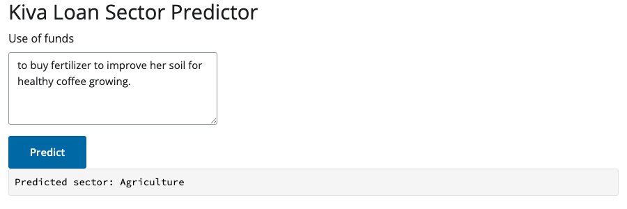

This is a small, low stakes example of building a complete machine learning pipeline in Python, from pulling raw data off a public API all the way to a working app that serves live predictions. Nothing here is meant to be taken too seriously. The dataset is small, the model is simple, and several of the modeling choices below were made for convenience.

The point of the exercise is to show the shape of a pipeline: extract, tidy, train, evaluate, deploy, serve, using tools from the Posit ecosystem (`pins`, `vetiver`, and Shiny for Python) to hold it together.

```{mermaid}
flowchart LR
    A["Extract\nkiva_extract.py"] --> B["Tidy\ntransform.py"]
    B --> C["Train\ntrain.py"]
    C --> D["Evaluate\nevaluate.py"]
    C --> E["Deploy\ndeploy.py"]
    E --> F["Serve\napp.py"]
```

## The data: microloans from Uganda

The data comes from [Kiva](https://www.kiva.org), a nonprofit that connects lenders with small businesses and entrepreneurs, mostly in low income countries. Each listing includes a short, free text description, written by a Kiva field partner on the borrower's behalf, describing what the loan will actually be used for. Something like "to buy fertilizer to improve her soil for healthy coffee growing."

I pulled about 2,000 loan listings from Uganda using Kiva's public API. The task I picked: predict which broad sector a loan belongs to (agriculture, business, or personal use) just from that short description.

::: {.callout-important}
This pipeline predicts sector labels. I use this example typically for illustration purposes.
:::

```{python}
#| label: load-packages
import pandas as pd
import pins
from sklearn.compose import ColumnTransformer
from sklearn.dummy import DummyClassifier
from sklearn.feature_extraction.text import TfidfVectorizer
from sklearn.linear_model import LogisticRegression
from sklearn.metrics import accuracy_score, classification_report, confusion_matrix, f1_score
from sklearn.model_selection import StratifiedKFold, cross_validate, train_test_split
from sklearn.pipeline import Pipeline
from sklearn.preprocessing import StandardScaler
import numpy as np
```

```{python}
#| label: load-data
board = pins.board_folder("pins_board", allow_pickle_read=True)
tidy = board.pin_read("kiva_tidy_loans")
tidy[["sector", "sector_grouped", "use"]].head()
```

## Step 1: pulling data from an API

The extraction step (`kiva_extract.py` in the repo) loops over Kiva's `loans/search` endpoint and collects four pages of 500 loans each, filtered to Uganda. 

This step is also the most fragile part of the whole pipeline, since it depends entirely on a third party API staying available and unchanged. That is worth keeping in mind for any pipeline that starts with "pulling data from someone else's website."

## Step 2: tidying the data and picking a target

Kiva's own sector labels are much finer grained than what we use here, eighteen categories in total, ranging from Agriculture (over 800 loans) down to sectors with a single loan. Modeling eighteen classes with that kind of imbalance is not a great use of anyone's time, so I made a judgment call to merge the rare sectors together, then group everything into three broader buckets.

```{python}
#| label: sector-groups
tidy["sector_grouped"].value_counts()
```

That grouping (Agriculture on its own, Retail and Services combined into Business, everything else combined into Personal) is not an official Kiva taxonomy. It is a modeling convenience chosen to get a more balanced, more tractable classification problem. If you needed the original fine grained sectors for a real application, you would want to handle the class imbalance properly (more data, resampling, hierarchical classification) rather than merging categories away.

## Step 3: why bag of words ?

Before reaching for anything heavier, it is worth asking why a simple bag of words model (TF-IDF plus logistic regression) was the reasonable first thing I tried here.

- The `use` field is short and fairly templated. Field partners tend to write structured phrases like "to buy X to do Y," not free flowing prose.
- The vocabulary is concrete and sector specific. Borrowers do not describe abstract plans, they describe fertilizer, cows, shop stock, and school fees.
- The dataset is small (2,000 rows). A method that does not need much data to find signal, and that stays interpretable, is a sensible starting point before considering anything like embeddings or transformer models.
- In many low income country contexts, the infrastructure to run larger NLP models is not always readily available or worth the operational cost for a problem this size. A linear model over word counts is cheap to train, cheap to serve, and easy to explain to a non technical stakeholder.

Here is a look at some of the vocabulary the model actually leans on for each sector:

```{python}
#| label: example
X = tidy[["use"]]
y = tidy["sector_grouped"]

X_train, X_test, y_train, y_test = train_test_split(
    X, y, test_size=0.2, random_state=2984, stratify=y,
)

text_pipe = Pipeline([
    ("preprocessor", ColumnTransformer([
        ("use_text", TfidfVectorizer(max_features=300, stop_words="english"), "use"),
    ])),
    ("model", LogisticRegression(class_weight="balanced", max_iter=1000)),
])
text_pipe.fit(X_train, y_train)

vectorizer = text_pipe.named_steps["preprocessor"].named_transformers_["use_text"]
clf = text_pipe.named_steps["model"]
feature_names = np.array(vectorizer.get_feature_names_out())

top_terms = {}
for i, cls in enumerate(clf.classes_):
    top_idx = np.argsort(clf.coef_[i])[-8:][::-1]
    top_terms[cls] = ", ".join(feature_names[top_idx])

pd.DataFrame.from_dict(top_terms, orient="index", columns=["top terms"])
```

None of these are just the class name in disguise. Agriculture leans on words like manure and fertilizer, Business leans on shop and merchandise, Personal leans on everyday household words like food and clothes. That is a reasonably good sign that the model is picking up real vocabulary patterns rather than matching a label to itself.

## Step 4: a baseline model

Before using any model, it is worth measuring how well you could do by guessing the most common class every time.

```{python}
#| label: baseline
cv = StratifiedKFold(n_splits=10, shuffle=True, random_state=2984)
scoring = {"accuracy": "accuracy", "f1_macro": "f1_macro"}

baseline_pipe = Pipeline([("model", DummyClassifier(strategy="most_frequent"))])
baseline_results = cross_validate(baseline_pipe, X_train, y_train, cv=cv, scoring=scoring)

print(f"Baseline accuracy: {baseline_results['test_accuracy'].mean():.3f}")
print(f"Baseline f1_macro: {baseline_results['test_f1_macro'].mean():.3f}")
```

Agriculture is the largest of the three classes, so a model that always guesses "Agriculture" would be right about 40 percent of the time. That is the number the real model has to beat.

## Step 5: training the model

The final pipeline is a `TfidfVectorizer` (capped at 300 terms, English stop words removed) feeding a `LogisticRegression` with `class_weight="balanced"`. We also tried adding `loan_amount` as a numeric feature alongside the text, on the theory that bigger loans might behave differently. It did not help at all, cross validated accuracy came out at 0.876 with text alone versus 0.874 with the amount included, so the final pipeline drops it and keeps things simple.

```{python}
#| label: cv-results
text_results = cross_validate(text_pipe, X_train, y_train, cv=cv, scoring=scoring)

print(f"CV accuracy: {text_results['test_accuracy'].mean():.3f} +/- {text_results['test_accuracy'].std():.3f}")
print(f"CV f1_macro: {text_results['test_f1_macro'].mean():.3f} +/- {text_results['test_f1_macro'].std():.3f}")
```

That is a solid jump over the baseline, using nothing more complicated than word counts and a linear model.

## Step 6: testing the model

The held out test set gets used exactly once, at the very end, after all modeling decisions are done. Using it any earlier would quietly bias the results, so it stays untouched until now.

```{python}
#| label: final-test
import vetiver

model = vetiver.VetiverModel.from_pin(board, "kiva_sector_model")
test = board.pin_read("kiva_sector_test")

X_holdout = test.drop(columns=["sector_grouped"])
y_holdout = test["sector_grouped"]
y_pred = model.model.predict(X_holdout)

print(f"Test accuracy: {accuracy_score(y_holdout, y_pred):.3f}")
print(f"Test f1_macro: {f1_score(y_holdout, y_pred, average='macro'):.3f}")
```

```{python}
#| label: confusion-matrix
labels = sorted(y_holdout.unique())
cm = confusion_matrix(y_holdout, y_pred, labels=labels)
pd.DataFrame(cm, index=labels, columns=labels)
```

Test performance (0.90 accuracy, 0.89 macro F1) is close to the cross validated estimate, which suggests the model is not just overfitting to one particular split. The main weakness is that Personal loans are often predicted as Business. That is understandable as household spending and small scale retail use much of the same vocabulary (food, shop, sell), so the line between the two is blurry in the source data itself.

## Step 7: shipping it as an API and an app

Once the model is trained, the rest of the pipeline is about making it usable:

- `train.py` saves the fitted pipeline as a model pin using `vetiver`, alongside a separate pin for the held out test rows.
- `deploy.py` loads that pin and wraps it in a small FastAPI app via `vetiver.VetiverAPI`, exposing a `/predict` endpoint.
- `app.py` is a small Shiny for Python app with a text box for the loan description, which calls that local API and displays the predicted sector.
- `app.py` loads the model pin directly rather than calling the separate API, which keeps it deployable as a single, self-contained piece of content (handy on platforms that only publish one app at a time).

Here is the app in action, predicting the sector for a loan described as going toward fertilizer and coffee growing:



**[Try the live predictor here](https://connect.posit.cloud/nangosyah/content/01a01fb0-ff97-6e6e-4409-2d9cda277861)**, it's deployed on Posit Connect Cloud and running the exact model described above.

Everything here runs locally aside from that live deployment, with `pins` standing in for a shared model store and `vetiver` standing in for a deployment layer. A real production setup at scale would likely also add authentication and monitoring, neither of which this small example attempts to solve.

It's worth noting:

- This is not a credit risk or lending decision tool. It predicts a coarse sector label from text, nothing more.
- The three class taxonomy (Agriculture, Business, Personal) is a modeling shortcut, not an official Kiva category.
- The data covers one country (Uganda) and one lending platform (Kiva). There is no reason to expect this to generalize elsewhere without retraining.
- Two thousand rows is a small dataset. Treat the metrics above as a reasonable estimate for this specific slice of data, not a universal truth about the model's quality.

## Try it yourself

Play with the [live predictor](https://connect.posit.cloud/nangosyah/content/01a01fb0-ff97-6e6e-4409-2d9cda277861) directly, no setup required.

The full code, including the extraction script, the tidying and training pipeline, the model card, and the Shiny app, is available in the [kiva-ml repository on GitHub](https://github.com/nangosyah/kiva-ml). The README walks through running each stage in order, from pulling fresh data to starting the local API and app.